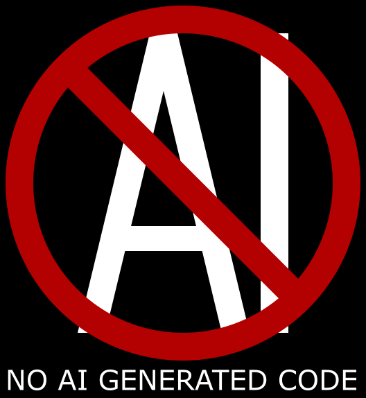

# YaCAD

YaCAD is Yet Another CAD application.

## Purposes

There are lots of different CAD application, so you can ask me, why? 
This is a test version. I want to try my ideas. Then I will develop a more advanced application.

## Building

Under development...

## Using

Under development...

## Other

My projects don't have AI generated code. But I'm not an AI-luddite and don't think it's generally a bad idea.
If you want to use some AI assistants, use them!
